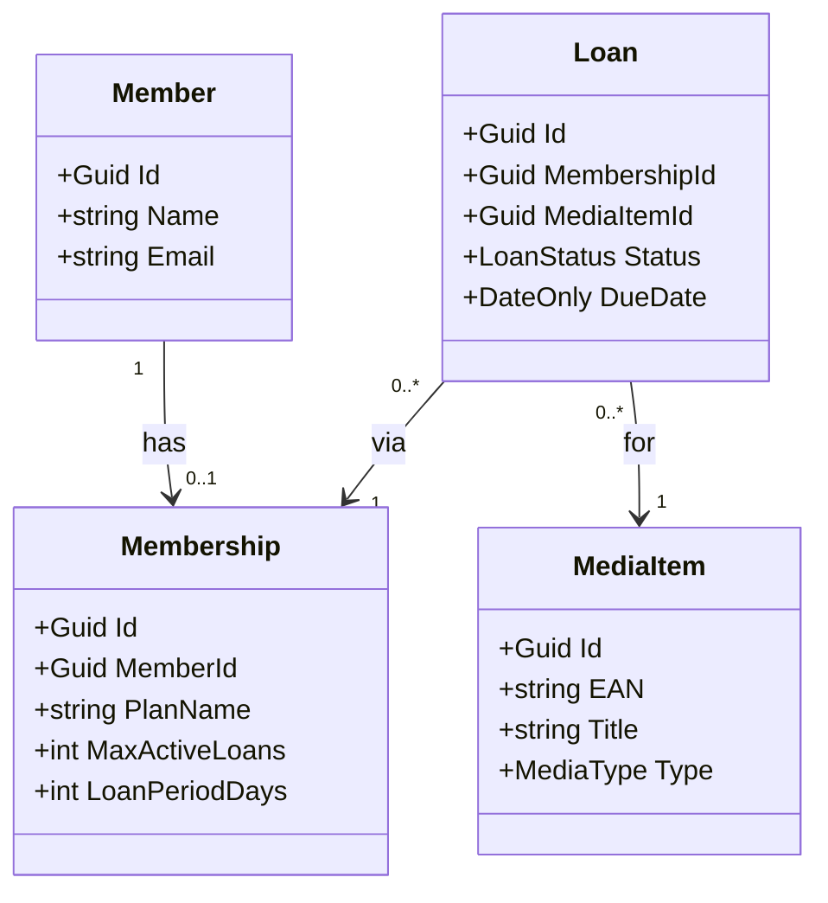

# Prompt

Du bist Softwarearchitekt und Spezialist für eine Bibliotheksverwaltungssoftware namens EasyBib. Wir setzen das Projekt um mit DDD und Clean Architecture. Wir verwenden EF Core und C# .NET10. Aber zuerst kümmern wir uns um das Domain Projekt. Es sollen folgende Entitäten abgebildet werden:

- Kunde (Name, E-Mail)
- Mitgliedschaft (Abodement)
- Medien (Enthält Typ wie Buch, Spiel, Film)
- Ausleihvorgang (Enthält Status, Frist)

Wir verwenden nur englische Bezeichner. Finde möglichst passende Namen dazu. Entwirf zunächst ein Klassendiagramm mit Mermaid.js, dass wir in unsere Doku als Markdown kopieren können.

Bei Unklarheiten und Lücken frage stets nach statt zu fabulieren. Das ganze soll im Rahmen einer Schulung entworfen werden. Daher soll der Aufwand des Projektes nur ca. ein Arbeitstag umfassen. Also nicht zu viele Details. Hast du Fragen zur Realisierung?

# Klassendiagram

# Handoff-Prompt

Gebe mir einen Handoff-Prompt für eine neue Session, um mit einem firschen Kontextfenster zu beginnen und bessere Ergebnisse zu erzielen. In der neuen Session möchte ich authentische Demodaten für unsere Datenbank generieren lassen in einer Klasse Seed.cs. Halte den Prompt kurz, aber präzise. Gebe das Datenmodell mit hinzu.

# Generierter Prompt für Seed Daten

Du bist Softwarearchitekt für EasyBib, eine Bibliotheksverwaltungssoftware (C#/.NET 10, EF Core, DDD/Clean Architecture). Das Domain-Projekt und der EasyBibDbContext existieren bereits; die Datenbank wird per Code First aus dem DbContext erzeugt.
Aufgabe: Erstelle eine Klasse Seed.cs im Infrastructure-Projekt, die authentische, realistische Demodaten generiert (deutsche Namen/E-Mails, plausible Titel, verschiedene Medientypen und Abo-Pläne) und sie per HasData in OnModelCreating einfügt, damit die Daten Teil der Migration werden.
Datenmodell:
Member: Guid Id, string Name, string Email, Membership? Membership (1:0..1)
Membership: Guid Id, Guid MemberId (FK), string PlanName, int MaxActiveLoans, int LoanPeriodDays
MediaItem: Guid Id, string Title, string EAN (eindeutiger Index), MediaType Type (Enum: Book, Game, Movie)
Loan: Guid Id, Guid MembershipId (FK), Guid MediaItemId (FK), LoanStatus Status (Enum: Active, Returned, Overdue), DateOnly DueDate
Namespace Domain: EasyBib.Domain; DbContext: EasyBib.Infrastructure.EasyBibDbContext mit DbSets: Members, Memberships, MediaItems, Loans
Wichtig: Verwende konstante v4 Guids für HasData, konsistente FK-Beziehungen, DueDate-Werte passend zum Status. Du weisst hoffentlich natuerlich, dass du kein DateTime.Now verwenden darfst sondern fixe Daten verwenden musst, da sonst eine Mirgration fehlschlagen kann.

Verwende Bezeichner aus der Popkultur, z. B. Futurama, Looney Tunes usw. damit die Demodaten interessanter werden.

