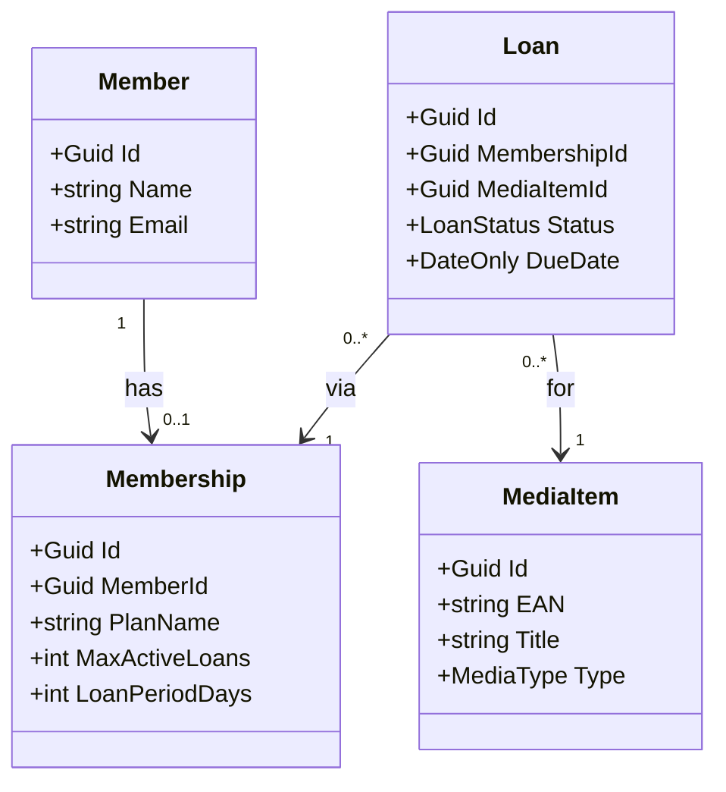

# Prompt

Du bist Softwarearchitekt und Spezialist für eine Bibliotheksverwaltungssoftware namens EasyBib. Wir setzen das Projekt um mit DDD und Clean Architecture. Wir verwenden EF Core und C# .NET10. Aber zuerst kümmern wir uns um das Domain Projekt. Es sollen folgende Entitäten abgebildet werden:

- Kunde (Name, E-Mail)
- Mitgliedschaft (Abodement)
- Medien (Enthält Typ wie Buch, Spiel, Film)
- Ausleihvorgang (Enthält Status, Frist)

Wir verwenden nur englische Bezeichner. Finde möglichst passende Namen dazu. Entwirf zunächst ein Klassendiagramm mit Mermaid.js, dass wir in unsere Doku als Markdown kopieren können.

Bei Unklarheiten und Lücken frage stets nach statt zu fabulieren. Das ganze soll im Rahmen einer Schulung entworfen werden. Daher soll der Aufwand des Projektes nur ca. ein Arbeitstag umfassen. Also nicht zu viele Details. Hast du Fragen zur Realisierung?

# Klassendiagram

# Handoff-Prompt

Gebe mir einen Handoff-Prompt für eine neue Session, um mit einem firschen Kontextfenster zu beginnen und bessere Ergebnisse zu erzielen. In der neuen Session möchte ich authentische Demodaten für unsere Datenbank generieren lassen in einer Klasse Seed.cs. Halte den Prompt kurz, aber präzise. Gebe das Datenmodell mit hinzu.

# Generierter Prompt für Seed Daten

Du bist Softwarearchitekt für EasyBib, eine Bibliotheksverwaltungssoftware (C#/.NET 10, EF Core, DDD/Clean Architecture). Das Domain-Projekt und der EasyBibDbContext existieren bereits; die Datenbank wird per Code First aus dem DbContext erzeugt.
Aufgabe: Erstelle eine Klasse Seed.cs im Infrastructure-Projekt, die authentische, realistische Demodaten generiert (deutsche Namen/E-Mails, plausible Titel, verschiedene Medientypen und Abo-Pläne) und sie per HasData in OnModelCreating einfügt, damit die Daten Teil der Migration werden.
Datenmodell:
Member: Guid Id, string Name, string Email, Membership? Membership (1:0..1)
Membership: Guid Id, Guid MemberId (FK), string PlanName, int MaxActiveLoans, int LoanPeriodDays
MediaItem: Guid Id, string Title, string EAN (eindeutiger Index), MediaType Type (Enum: Book, Game, Movie)
Loan: Guid Id, Guid MembershipId (FK), Guid MediaItemId (FK), LoanStatus Status (Enum: Active, Returned, Overdue), DateOnly DueDate
Namespace Domain: EasyBib.Domain; DbContext: EasyBib.Infrastructure.EasyBibDbContext mit DbSets: Members, Memberships, MediaItems, Loans
Wichtig: Verwende konstante v4 Guids für HasData, konsistente FK-Beziehungen, DueDate-Werte passend zum Status. Du weisst hoffentlich natuerlich, dass du kein DateTime.Now verwenden darfst sondern fixe Daten verwenden musst, da sonst eine Mirgration fehlschlagen kann.

Verwende Bezeichner aus der Popkultur, z. B. Futurama, Looney Tunes usw. damit die Demodaten interessanter werden.

# Business Rules (Von Vibe ausgearbeitet)

## Prompt 

Wir sollten als nächsten Schritt Repositories für unsere Entitäten anlegen, oder? Wo können wir CRUD verwenden und bei welchen Entitäten ist deines Erachtens CRUD nicht sinnvoll? Denke daran, dass uns Clean Architecture und DDD wichtig ist. Bei Loan macht CRUD vermutlich keinen Sinn. Was sind sinnvolle Prozesse?

Guter Punkt – und genau richtig erkannt: **Loan ist kein CRUD-Kandidat.** Hier meine Einschätzung:

## CRUD ja, aber...

**MediaItem** – klassischer CRUD-Fall. Katalogverwaltung (anlegen, Titel/EAN korrigieren, entfernen) hat keine echten Geschäftsregeln jenseits von Validierung. Ein generisches `IMediaItemRepository` mit `Add/Update/Delete/GetById/List` passt hier.

**Member** – überwiegend CRUD (Stammdaten: Name, E-Mail), aber mit einem Vorbehalt: die **Zuordnung/Wechsel der Membership** ist ein Domänenprozess, kein simples Setter-Update. Also: CRUD für Stammdaten, aber `AssignMembership()` / `ChangePlan()` gehört als Methode auf die Entität.

**Membership** – hier würde ich gar kein eigenes Repository anbieten. Membership ist Teil des `Member`-Aggregats (Fremdschlüssel `MemberId`, 1:0..1). Es wird über `MemberRepository` mitgeladen und -gespeichert. Ein separates Repository würde die Aggregatgrenze aufweichen.

## Loan: Prozesse statt CRUD

Ein Loan hat einen **Lebenszyklus** – die Statusübergänge sind die eigentliche Domänenlogik. Sinnvolle Prozesse:

| Prozess | Methode | Regel |
|---|---|---|
| Medium ausleihen | `LoanService.CheckOut(membershipId, mediaItemId)` | Prüft `MaxActiveLoans`, setzt `DueDate` = heute + `LoanPeriodDays` |
| Rückgabe | `loan.MarkReturned()` | `Active/Overdue → Returned` |
| Frist prüfen | `loan.MarkAsOverdue(today)` | nur `Active → Overdue` |
| Verlängern | `loan.Extend(days)` | nur solange `Active` |

**DDD-Konsequenzen:**
- **Kein `ILoanRepository.Update()`** – sonst kann jeder Status einfach überschrieben werden. Das Repository bietet nur `Add`, `GetById`, `GetActiveLoansFor(membershipId)` (für die `MaxActiveLoans`-Prüfung) und `Save`.
- Statusübergänge passieren **auf der Entität** (`MarkReturned`, `Extend`) – der Status-Setter sollte später private werden, damit EF Core nicht als Hintertür für illegale Übergänge missbraucht wird.
- `CheckOut` gehört als **Domain-Service** (`LoanService`) in die Domain, weil er zwei Aggregate (Membership und MediaItem) koordiniert – die `MaxActiveLoans`-Prüfung braucht Daten aus beiden.

## Resultierendes Bild

- `IMemberRepository` – CRUD + Aggregate Root (inkl. Membership)
- `IMediaItemRepository` – CRUD
- `ILoanRepository` – nur der kleine, absichtlich eingeschränkte Funktionsumfang
- `LoanService` (Domain) – `CheckOut`-Prozess

Für Clean Architecture liegen die Interfaces in der **Domain**, die EF-Core-Implementierungen in der **Infrastructure**.

Soll ich dir die beiden Repositories plus `LoanService` und die erweiterte `Loan`-Entität (mit privatem Status-Setter und Prozessmethoden) als C#-Canvas generieren?